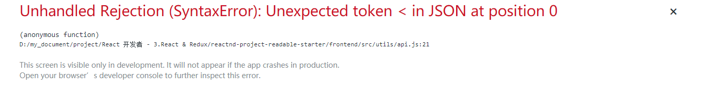
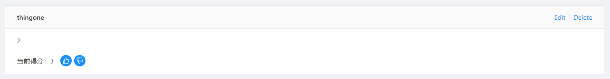
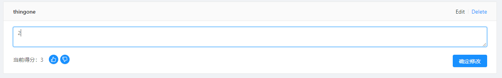

[TOC]

## 组件（页面）初始化状态

一个组件或者一个页面有一个初始状态，最好是利用组件本身 componentDidMount 钩子来设置这个状态，而不是通过其他组件来设置。当然，我指的是无论什么情况下回到这个页面，这个页面都需要呈现相同的状态。如果你因为在其他页面通过操作而改变了这个页面状态，那你还是需要在其他组件中通过对状态的改变来改变页面。

为什么会思考这个问题？

我的主页面中排序功能是默认以当前得分排序，当我点击其他排序方式过后，store 中的状态随之改变，我从其他页面回到这个页面时，由于我的 UI 显示的是得分排序，但实际上列表中的项依然是其他排序方式，因为我 store 中的状态没有改变。


最开始，我是通过当我点击确定提交或者确定修改后回来主页面时改变 store，但这样有一个问题，如果我只是通过向前向后的浏览器操作，并不会改变 store，因此我觉得一个页面的状态初始化，最好还是让组件（页面）本身来修改更好，如果其他组件或页面要改变这个状态，那么也可以改变。

## 使用 ref 引用时，如果节点不存在的处理方式

```jsx
handleChangeEdit = (e) => {
  e.preventDefault()
  this.setState({
    isEdit: true
  })
  setTimeout(() => {
    this.textInput && this.textInput.focus()
  }, 50);
}

// 优化后
handleChangeEdit = (e) => {
  e.preventDefault()
  this.setState({
    isEdit: true
  },()=>{this.textInput && this.textInput.focus()})
}
```

上面这段代码是当我点击 Edit 按钮时所触发的，因为我想当点击的时候让光标聚焦在 textArea 框中，所以引用了 textArea。

问题在于还没有点击 Edit 时，页面中是不存在 textArea 的，所以引用时会出错。因此刚开始我延迟了执行的时间，让 textArea 在页面中出现时再引用并聚焦。但这存在一个问题，因为你不知道多久会执行完并出现，所以我先做了一个判断然后再执行聚焦。

优化后。第一种方式其实有点傻，原因是 this.setState 与 setTimeout 都是异步，目前我并不知道谁先执行，如果是 setTimeout 先执行，就会出现不聚焦的情况，因为页面中并没有 textArea。因此，我们可以利用在 setState 中的第二个参数来解决这个问题。


## 注意，接口中修改的 method 是 PUT 而不是 POST

```jsx
// 修改某一评论的内容
export function changeCommentBodyAPI(id,body) {
  return fetch(`${api}/comments/${id}`, {
    headers: {
      ...headers,
      'Content-Type': 'application/json'
    },
    method: 'PUT',
    body: JSON.stringify({
      timestamp: Date.now(),
      body
    })
  }).then(res => res.json())
}
```

这里一直出现问题，服务器那边也返回了收到错误信息的提示，但一直没有找到问题。最后发现是由于 method 传入的是 POST 而不是 PUT。


## fetch 需要处理数据请求失败的情况

出现的错误提示：



问题是出现 api.js 文件中我并没有对 fetch 请求失败进行处理，其实很简单，只需要添加 catch 就行：

```jsx
return fetch(newApi, { headers }).then(res => {
    return res.json()
  }).catch((res) => {
    return res
  })
```

## 子组件使用 state，但初始化时使用 props 的问题

```jsx
// 子组件状态
class CommentItem extends Component {
  state = {
    isEdit: false,
    body: this.props.item.body,
    vote: this.props.item.voteScore,
  }
```

子组件视图：



### 为什么要使用 state，并且为什么要让 state.body 是 props 默认传过来的

当我点击 Edit 时会出现下面这样的 input 框，默认 value 是现在评论的内容，也就是 body：



value 的值要修改需要使用到 `onChange` 事件来改变组件的状态从而改变 value 的值，所以使用到了 state。但这并不是必须这样，可是这是我所能想到的最简便的方式。至于比较复杂的方法可以是改变 store 中的 comments 中的这一条评论，这需要对 comments 数组做遍历对比出目前我所改变的是哪一条评论（但如果数据是范式化就能够很轻松的获取到）。

由于初始值是由父组件传过来的值，所以就让 state.body 的值为 props 所传过来的。

### 出现的问题

当我们修改了评论后，去其他页面再返回到这个页面时（某一条帖子），内容依然是之前的，但是如果我们再去其他页面再返回就是修改后的的页面了。

### 为什么会有这样的问题

由于父组件的数据获取是在 render 之后的，无论你是放在 `componentDidMount` 还是放在 `componentWillMount` 都是，因为数据获取是异步的，，组件重新渲染。 问题就在于 render 之后，render 时子组件也会被渲染，子组件就会执行初始化的操作 —— `constructor()`，但 constructor 只会执行一次，就算异步请求过后获得数据重新渲染父组件从而重新渲染子组件，但初始化也只有那么一次，因此 state 还是之前的 state。

### 如何解决

```jsx
class PostDetail extends Component {
  componentDidMount() {
    const id = this.props.match.params.id
    this.props.dispatch(getPost(id))
    this.props.dispatch(changeCateIndex(5))
    this.props.dispatch(getComments(id))
  }

  componentWillUnmount() {   // 关键部分
    const id = this.props.match.params.id
    this.props.dispatch(getComments(id))
  }
```

这是父组件，解决的方式就是当父组卸载的时候去获取 comments 的数据提前让 store 发生改变，这样当渲染子组件时所传入的值就是最新的值了。

当然你也可以把 store 的改变放到其他地方，比如 input 确定修改时的地方。


## 进入详情页会有 404 闪现的情况

先看代码：

```jsx
post.id === undefined ? (
  <NoMatch />
) : (
  <div>
    <div className="detail-postTitle">{post.title}</div>
```

- 由于 post.id 在一开始肯定为 undefined，因为 post 的内容是异步获取的，需要等异步请求完成后更改 store 之后才会更新，所以一开始会渲染`<NoMatch>`组件出现 404，然后才会渲染带有帖子的内容

解决方式很简单，添加一个`<Loading>`组件，一开始显示它，当异步请求完成后发送请求改变状态再根据情况显示内容即可：

```jsx
{isLoading ? (
  <div className="loading">
    <Loading type="spin" color="#041427" />
  </div>
) : post.id === undefined ? (
  <NoMatch />
) : (
  <div>
    <div className="detail-postTitle">{post.title}</div>
```

- `isLoading`状态依然存放 store 中
- `<Loading>`组件是使用的`react-loading`库的组件
- 这里很有意思的是使用了三元操作符的嵌套，可以实现像是 if 里面嵌套 if 的感觉


## 动画无法使用 Switch 而需要重定向的问题

由于使用`react-transition-group`库来实现页面跳转动画而无法使用`<Switch/>`组件来帮助实现页面重定向，因此用了一个比较有意思的方式来解决这个问题，代码如下：

```jsx
{routes.map(({ path, Component }) => (
  <Route key={path} exact path={path}>
    {({ ...props }) => (
      <CSSTransition
        in={props.match !== null}
        timeout={300}
        classNames="page-transition"
        unmountOnExit
        >
        <div className="page-transition">
          <Component {...props}/>
        </div>
      </CSSTransition>
    )}
  </Route>
))}
<Switch>
  {routes.map(({ path, Component }) => (
    <Route key={path} exact path={path} component={null} />
  ))}
  <Redirect to='/404'/>
</Switch>
```

可以看到 R1-R16 是通过遍历 routes 数组来实现添加路由，但如果需要`<CSSTransition>`组件来实现动画，则外层不能使用`<Switch>`进行包裹，但这使当 url 不匹配设置好的路由的情况下很难实现重定向到 404，所以我通过在遍历路由的下方使用`<Switch>`包裹新的遍历，但此遍历不渲染然后组件，然后在最后添加`<Redireact>`组件来实现重定向。