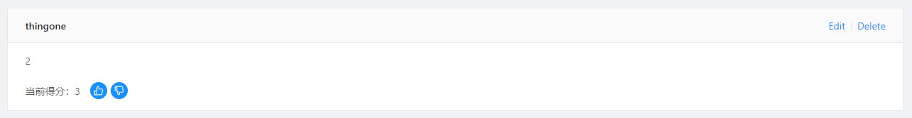
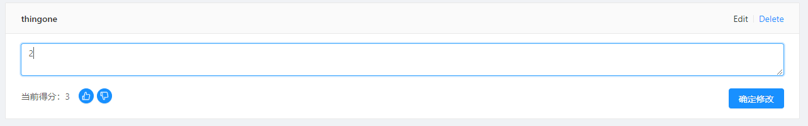

[TOC]

## 组件（页面）初始化状态

一个组件或者一个页面有一个初始状态，最好是利用组件本身 componentDidMount 钩子来设置这个状态，而不是通过其他组件来设置。当然，我指的是无论什么情况下回到这个页面，这个页面都需要呈现相同的状态。如果你因为在其他页面通过操作而改变了这个页面状态，那你还是需要在其他组件中通过对状态的改变来改变页面。

为什么会思考这个问题？

我的主页面中排序功能是默认以当前得分排序，当我点击其他排序方式过后，store 中的状态随之改变，我从其他页面回到这个页面时，由于我的 UI 依然是得分排序，但实际上的排序是其他排序方式，因为我 store 中的状态没有改变。


最开始，我是通过当我点击确定提交或者确定修改后回来主页面时改变 store，但这样有一个问题，如果我只是通过向前向后的浏览器操作，并不会改变 store，因此我觉得一个页面的状态初始化，最好还是让组件（页面）本身来修改更好，如果其他组件或页面要改变这个状态，那么也可以改变。


## Link 组件中 onClick 传箭头函数的 this 问题

```jsx
<Link to={`/modify-post`} 
      onClick={(e) => {
      console.log(record.key)
      this.props.changeID(record.key)
      debugger
}}>Edit</Link>
```

这里的 this 指向的是 Link 这个组件，也就是这个类，而不是所在组件，具体原因目前还不清楚，但我的猜想是箭头函数会在 Link 这个组件内执行，而不是在父组件的位置执行，因此会指向 Link。

解决的办法是，不使用 this.props，而是将 this.porps 中的属性结构出来，再传入：

```jsx
const { changeID } = this.props
```


## dispatch 的异步性及一些关于程序的想法

```jsx
  componentDidMount(){
    const id = this.props.match.params.id
    this.props.dispatch(changePostID(id))
    console.log(this.props.post)
  }
```

这是 PostDetail 组件中的 componentDidMount。第三行代码中使用了 dispatch，但是在接下来的 console.log(this.props.post) 中，post 是空，也就是说 dispatch 过后并没有等待 dispatch 执行完毕，而是异步的，所以在接下来的代码中才无法接受到这个参数。可这并不是关键。

关键的问题是，我这里并不需要去 dispatch 来改变其 id，我只需要这个 id 就行了。我需要这个 id 来获取 post，并不需要先存储在 store 中，而为什么出现这个问题，是由于之前在主页面中点击 edit 跳转到编辑页面时，我需要一个 id，但这个 id 是在加载组件之前就要有，我就先存储到了 store 中。但这里是不需要这样操作的。。


## 使用 ref 引用时，如果节点不存在的处理方式

```jsx
  handleChangeEdit = (e) => {
    e.preventDefault()
    this.setState({
      isEdit: true
    })
    setTimeout(() => {
      this.textInput && this.textInput.focus()
    }, 50);
  }
  
  // 优化后
    handleChangeEdit = (e) => {
    e.preventDefault()
    this.setState({
      isEdit: true
    },()=>{this.textInput && this.textInput.focus()})
  }
```

上面这段代码是当我点击 Edit 按钮时所触发的，因为我想当点击的时候让光标聚焦在 textArea 框中，所以引用了 textArea。

问题在于还没有点击 Edit 时，页面中是不存在 textArea 的，所以引用时会出错。因此刚开始我延迟了执行的时间，让 textArea 在页面中出现时再引用并聚焦。但这存在一个问题，因为你不知道多久会执行完并出现，所以我先做了一个判断然后再执行聚焦。

优化后。第一种方式其实有点傻，原因是 this.setState 与 setTimeout 都是异步，目前我并不知道谁先执行，如果是 setTimeout 先执行，就会出现不聚焦的情况，因为页面中并没有 textArea。因此，我们可以在 setState 中的第二个参数中传入一个回调来执行。


## 注意，接口中修改的 method 是 PUT 而不是 POST

```jsx
// 修改某一评论的内容
export function changeCommentBodyAPI(id,body) {
  return fetch(`${api}/comments/${id}`, {
    headers: {
      ...headers,
      'Content-Type': 'application/json'
    },
    method: 'PUT',
    body: JSON.stringify({
      timestamp: Date.now(),
      body
    })
  }).then(res => res.json())
}
```

这里一直出现问题，服务器那边也返回了收到错误信息的提示，但一直没有找到问题。最后发现是由于 method 传入的是 POST 而不是 PUT


## antd 中 Input 组件 onClick 传入回调中的 this 指向问题

```jsx
  handleSubmitComment = (that) => {
    addCommentAPI({
      id: random24(),
      timestamp: Date.now(),
      body: that.bodyInput.textAreaRef.value,
      owner: that.authorInput.input.value,
      parentId: that.props.match.params.id
    }).then(res => {
      that.bodyInput.textAreaRef.value = ''
      that.authorInput.input.value = ''
      that.props.dispatch(getComments(that.props.match.params.id))
      that.props.dispatch(getPost(that.props.match.params.id))
    })
  }
  
  // 组件内部
 <Button onClick={()=>{this.handleSubmitComment(this)}} type="primary" size="large">
      发表评论
</Button> 
```

其实这个问题在之前使用 Link 时已经出现过了，在那个是时候我是讲 this 中的属性放到函数外面然后再传入这个属性，但其实也有另外一种非常好用的方式，就是使用 that 来代替 this，在传入回调时传入 this，这样在调用时就是当时环境下的 this，而不是执行环境的 this。


## 子组件使用 state，但初始化时使用 props 的问题

```jsx
// 子组件状态
class CommentItem extends Component {
  state = {
    isEdit: false,
    body: this.props.item.body,
    vote: this.props.item.voteScore,
  }
```

子组件 UI：



### 为什么要使用 state，并且为什么要让 state.body 是 props 默认传过来的

当我点击 Edit 时会出现下面这样的 input 框，默认 value 是现在评论的内容，也就是 body：



value 的值要修改需要使用到 `onChange` 事件来改变组件的状态从而改变 value 的值，所以使用到了 state。但这并不是必须这样，可是这是我所能想到的最简便的方式。至于比较复杂的方法可以是改变 store 中的 comments 中的这一条评论，这需要对 comments 数组做遍历对比出目前我所改变的是哪一条评论。

由于初始值是由父组件传过来的值，所以就让 state.body 的值为 props 所传过来的。

### 出现的问题

问题是当我们修改了评论的内容后，返回主页面或者其他页面再返回到这个页面时（某一条帖子），内容依然是之前的，但是如果我们再去其他页面再返回就是修改后的的页面了。

### 为什么会有这样的问题

我觉得是由于父组件的数据获取是在 render 之后的，无论你是放在 `componentDidMount` 还是放在 `componentWillMount` 都是，因为数据获取是 ajax 请求有异步性，组件执行 render 后才会获取到数据，然后发现 store 中的数据改变，组件重新渲染。 问题就在于 render 之后，render 时子组件也会被渲染，子组件就会执行初始化的操作 —— `constructor()`，但 constructor 只会执行一次，就算异步请求过后获得数据重新渲染父组件从而重新渲染子组件，但初始化也只有那么一次，因此 state 还是之前的 state。

### 如何解决

```jsx
class PostDetail extends Component {
  componentDidMount() {
    const id = this.props.match.params.id
    this.props.dispatch(getPost(id))
    this.props.dispatch(changeCateIndex(5))
    this.props.dispatch(getComments(id))
  }

  componentWillUnmount() {   // 关键部分
    const id = this.props.match.params.id
    this.props.dispatch(getComments(id))
  }
```

这是父组件，解决的方式就是当父组卸载的时候去获取 comments 的数据提前让 store 发生改变，这样当渲染子组件时所传入的值就是最新的值了。

当然你也可以把 store 的改变放到其他地方，比如 input 确定修改时的地方。